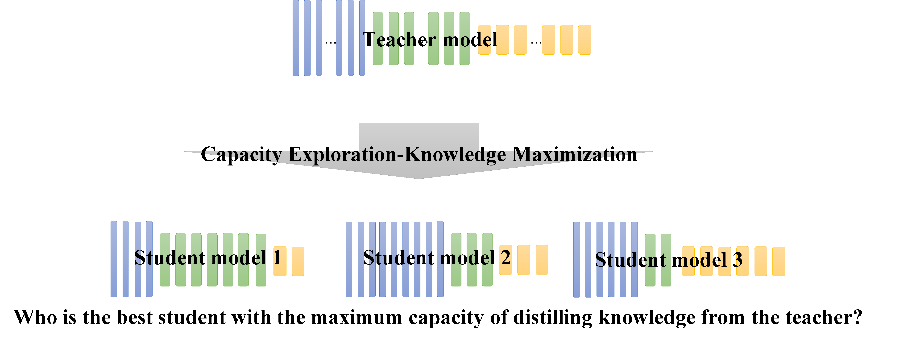

# CRD-EMKD

This repo covers the implementation of Capacity Exploration and Knowledge Maximizationfor Knowledge Distillation.

This project is based on the [CRD project](https://github.com/HobbitLong/RepDistiller).



## Training

1. Fetch the pretrained teacher models by:

    ```
    sh scripts/fetch_pretrained_teachers.sh
    ```
   which will download and save the models to `save/models`

2. Run the commands in `scripts/train.sh` to train student model using distillation. Here is an example of training a student model using CRD distillation method.

    ```
    CUDA_VISIBLE_DEVICES=0 python train_student.py --model_t resnet110 --path_t ./checkpoints/cifar100/resnet110_vanilla/ckpt_epoch_240.pth --distill crd --model_s resnet20 -a 0 -b 0.8 --trial 1
    ```
    where the meaning of these parameters are:
    - `model_t`: the teacher model
    - `path_t`: the path where teacher model is saved
    - `distill`: what kind of distill method used in distillation
    - `model_s`: the student model
    - `a`: the weight of the KD loss
    - `b`: the weight of other distillation losses
    - `trial`: used for differentiate between multiple runs

    Another example of training a student model using CRD combined with MC is given by:

    ```
    CUDA_VISIBLE_DEVICES=0 python train_student.py --model_t resnet110 --path_t ./checkpoints/cifar100/resnet110_vanilla/ckpt_epoch_240.pth --distill crd --mc 1 --mc_weight 0.001 --model_s myresnet20 --block_depth 3,7,2 -a 0 -b 0.8 --trial 1
    ```
    
    where the meaning of additional parameters are:
    - `mc`: set 1 if using milestone checking; else, set 0. default: `0`
    - `model_s`: if the model name begins with `my`, it means that the student model with self-defined architecture will be trained
    - `block_depth`: the architecture of specific student model. default: `3,3,3`

3. Run the commands in `scripts/search.sh` to search for a best student architecture using BCS (Block Compostion Search). Here is an example of seaching a student model using CRD_MC.
    ```
    CUDA_VISIBLE_DEVICES=0 python search.py --model_t resnet110 --path_t ./checkpoints/cifar100/resnet110_vanilla/ckpt_epoch_240.pth --distill crd --mc 1 --mc_weight 0.001 --model_s myresnet20 --block_depth 3,3,3 -a 0 -b 0.8 --trial 1
    ```
    The only difference is using `search.py` to replace `train_student.py` when searching.

## Acknowledgement

Thanks to Yonglong Tian for providing the code of CRD and implementation of other distillation methods.
