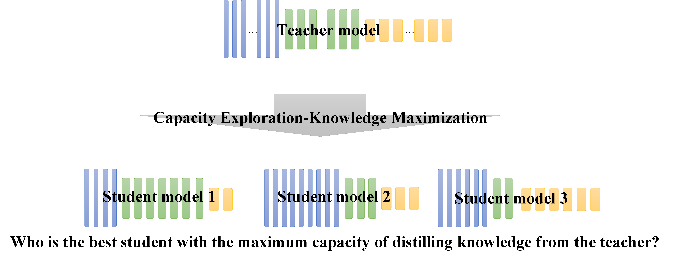

# SSKD
This repo covers the implementation of Capacity Exploration and Knowledge Maximizationfor Knowledge Distillation.

This project is based on the [SSKD project](https://github.com/xuguodong03/SSKD).



## Running

### Teacher Training
An example of teacher training is:
```
python teacher.py --arch wrn_40_2 --lr 0.05 --gpu-id 0
```
where you can specify the architecture via flag `--arch`

You can also download all the pre-trained teacher models [here](https://drive.google.com/drive/folders/1vJ0VdeFRd9a50ObbBD8SslBtmqmj8p8r?usp=sharing). 
If you want to run `student.py` directly, you have to re-organise the directory. For instance, when you download *vgg13.pth*, you have to make a directory for it, say *teacher_vgg13*, and then make a new directory *ckpt* inside *teacher_vgg13*. Move the *vgg13.pth* into *teacher_vgg13/ckpt* and rename it as *best.pth*. If you want a simpler way to use pre-trained model, you can edit the code in `student.py` (line 90).

### Student Training
1. Run the commands in `train.sh` to train student model using distillation. Here is an example of training a student model using SSKD distillation method.

    ```
    CUDA_VISIBLE_DEVICES=0 python student.py --t-path ./checkpoints/cifar100/resnet110_vanilla/ckpt_epoch_240.pth --t-arch resnet110 --s-arch resnet20 --distill sskd --lr 0.05 --gpu-id 0 --trial 1
    ```
    where the meaning of these parameters are:
    - `t_path`: the path where teacher model is saved
    - `t_arch`: the teacher model
    - `s_arch`: the student model
    - `distill`: what kind of distill method used in distillation
    - `lr`: learning rate
    - `gpu-id`: the id of used gpu, consistent with CUDA_VISIBLE_DEVICES 
    - `trial`: used for differentiate between multiple runs

    Another example of training a student model using SSKD combined with MC is given by:

    ```
    CUDA_VISIBLE_DEVICES=0 python student.py --t-path ./checkpoints/cifar100/resnet110_vanilla/ckpt_epoch_240.pth --t-arch resnet110 --s-arch myresnet20 --distill sskd --mc 1 --depth 3,7,2 --lr 0.05 --gpu-id 0 --trial 1
    ```
    
    where the meaning of additional parameters are:
    - `mc`: set 1 if using milestone checking; else, set 0. default: `0`
    - `s_arch`: if the model name begins with `my`, it means that the student model with self-defined architecture will be trained
    - `depth`: the architecture of specific student model. default: `3,3,3`

2. Run the commands in `search.sh` to search for a best student architecture using BCS (Block Compostion Search). Here is an example of seaching a student model using SSKD_MC.
    ```
    CUDA_VISIBLE_DEVICES=0 python search.py --t-path ./checkpoints/cifar100/resnet110_vanilla/ckpt_epoch_240.pth --t-arch resnet110 --s-arch myresnet20 --distill sskd --mc 1 --depth 3,3,3 --lr 0.05 --gpu-id 0 --trial 1
    ```
    The only difference is using `search.py` to replace `student.py` when searching.

## Acknowledgement
Thanks to GuoDong Xu for providing the code of SSKD.
